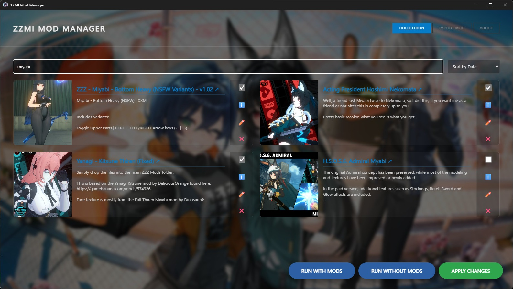

# XXMI Manager
*rather simple mod manager for XXMI mods (ZZZ, GI, HSR, HI3, WuWa, EF)*


---

made it when i realised that i need some easy way to toggle the mods on and off on the fly, so here it is. it works by creating a symlink to the mod, simple as that.
(yes i am aware that other solutions already exist, i've realised that only after publishing the v1.0.0... pick your poison either way)

---
### build
```
git clone https://github.com/lz-fkn/XXMI-Mod-Manager.git
cd XXMI-Mod-Manager
go install github.com/wailsapp/wails/v2/cmd/wails@latest
go mod tidy
wails build
```

---
### install
simply put xxmimm.exe in the root folder of your xxmi loader, for example, in
`C:\Users\User\AppData\Roaming\XXMI Launcher\ZZMI` in case of ZZMI.

---

### todo
- [ ] download mods from gamebanana
- [ ] profiles
- [ ] import/export of mods or whole profiles/modpacks
- [x] autodetect of the game
- [x] mod sorting by game
- [x] "play with/without mods" buttons

---
#### used stuff:
* [Golang](https://go.dev/) (go1.25.5 windows/amd64)
* [Wails](https://wails.io/) (v2.11.0)
* [Marked.js](https://github.com/markedjs/marked) (v17.0.1)

---
Elzzie. 2026, MIT License. Background images are property of their respective copyright holders (HoYoverse, Kuro Games, Gryphline).
